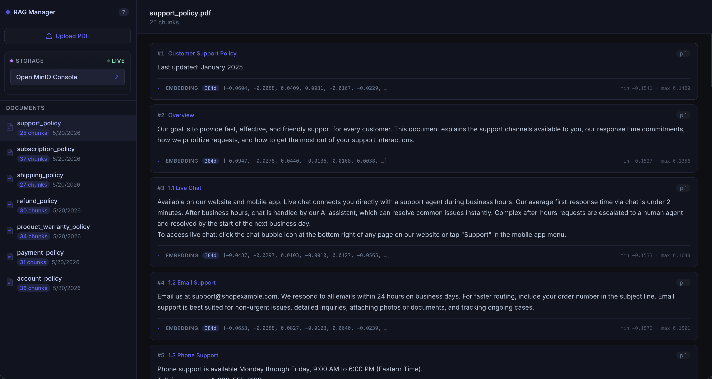
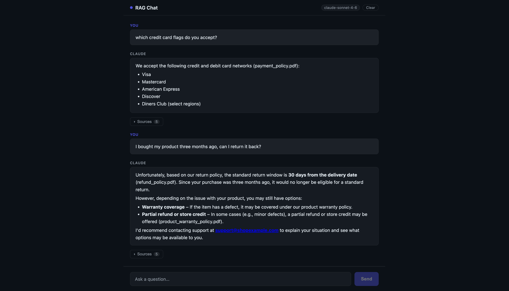

# RAG v2

Chat with a fixed corpus of Projetos de Lei. Retrieves only relevant chunks
before answering — no full-doc context stuffing.

week01 does not manage files. The corpus is split into chunks once in
[`../dataset`](../dataset), committed as parquet, and loaded from there. No
PDFs, no object store, no PDF parsing at runtime.

## Screenshots

**Document Manager** — browse documents, inspect chunks and embeddings



**Chat UI** — answers grounded in the corpus with source citations



---

## Architecture

```
        ../dataset/out/corpus.parquet
                    │
                    │ read · embed · insert (one-shot, at boot)
                    ▼
┌─────────────────┐          ┌────────────────────────────────────┐
│  documents-ui   │ ───────▶ │        PostgreSQL + pgvector       │
│  React · :3000  │  browse  │   documents · chunks · HNSW index  │
└─────────────────┘          └────────────────────────────────────┘
                                      ▲              ▲
                               search │              │ read
                                      │              │
┌─────────────────┐   ask     ┌───────┴──────┐       │
│   chat UI       │ ────────▶ │ document-api │───────┘
│  Next.js · :3001│ ◀──────── │ FastAPI·:8000│
└─────────────────┘  answer   └──────────────┘
```

---

## How It Works

1. **Load** — `loader` reads `../dataset/out/corpus.parquet` (183 chunks, already
   split, with source filename and page numbers) and writes them to Postgres
2. **Embed** — each chunk converted to a 384-d vector

   ```
   "Items must be returned within 30 days." → [0.0521, -0.1843, 0.3012, ...]

   "How do I get a refund?"       → [0.0489, -0.1901, 0.3144, ...]  ← close
   "Items must be returned..."    → [0.0521, -0.1843, 0.3012, ...]  ← close
   "What are your shipping rates?"→ [-0.1200, 0.2744, -0.0831, ...] ← far
   ```
3. **Index** — vectors stored in PostgreSQL with an HNSW cosine index
4. **Query** — question vectorized, top-5 matching chunks retrieved
5. **Answer** — Claude answers using only retrieved chunks, returns sources

`chunks.chunk_id` is the dataset's own key (`PL_1502_2026::0003`), not a
`SERIAL`. It survives a reload, which is what lets week02's ground truth keep
pointing at the right rows.

The loader is idempotent: it records which (corpus, embedding model) pair is in
the database and skips itself when they already match. Change either and it
wipes and reloads — a half-swapped index is worse than a slow boot.

```bash
docker compose run --rm loader --force        # reload regardless
docker compose run --rm loader --self-check   # row coercion asserts, no DB
```

---

## Services

| Service | Tech | Port | Role |
|---|---|---|---|
| `documents-ui` | React + Vite | 3000 | Browse documents, chunks, embeddings (read-only) |
| `chat` | Next.js | 3001 | Chat interface |
| `document-api` | Python / FastAPI | 8000 | REST API, vector search |
| `loader` | Python | — | One-shot: parquet → embed → Postgres, then exits |
| `postgres` | PostgreSQL 16 + pgvector | 5432 | Chunk and vector storage |

---

## Running Locally

**Prerequisites:** Docker, Docker Compose, Anthropic API key

The dataset must exist before the stack boots. It is committed, so this is only
needed if `../dataset/out/` is empty:

```bash
cd ../dataset && docker compose run --rm build
```

Then:

```bash
echo "ANTHROPIC_API_KEY=sk-ant-..." > .env
docker compose up --build
# First boot downloads the embedding model, ~1 min. No PDF parsing.
```

| UI | URL |
|---|---|
| Chat | http://localhost:3001 |
| Document manager | http://localhost:3000 |
