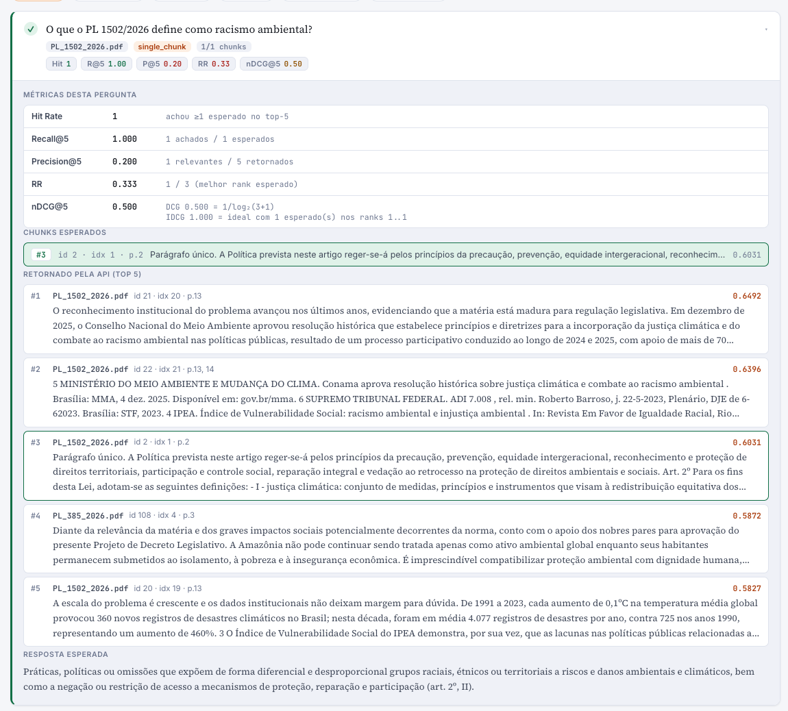
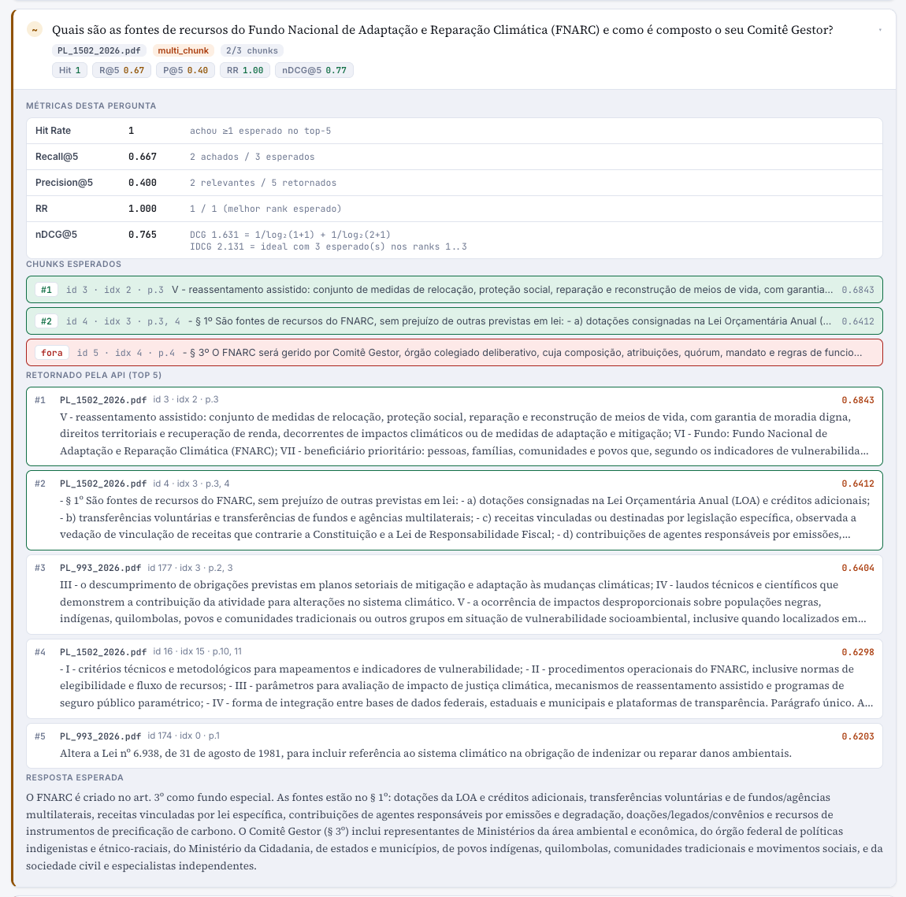
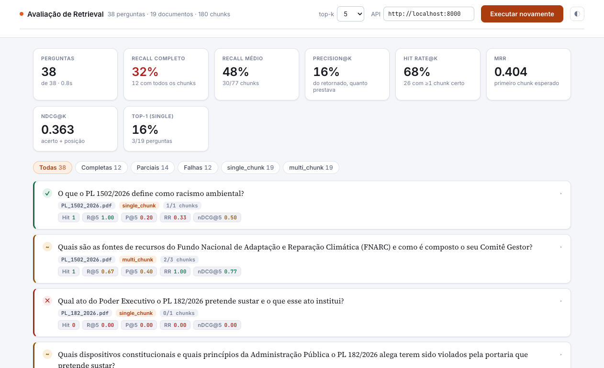

# week02 — métricas

**Antes:** "a busca parece boa". **Agora:** um número por versão do RAG.

Um gabarito diz, pra cada pergunta, quais chunks têm a resposta. A busca devolve
5 chunks; as métricas contam quantos certos vieram e em que posição.

```json
{ "question": "O que o PL 1502/2026 define como racismo ambiental?",
  "expected_chunks": [ { "chunk_index": 1 } ] }
```

38 perguntas assim, em [`questions.json`](questions.json).

## As 5 notas

| métrica | pergunta que responde |
|---|---|
| Hit Rate | veio **pelo menos um** certo? |
| Recall | veio **quantos %** dos certos? |
| Precision | dos 5 que vieram, **quantos %** prestavam? |
| MRR | o certo veio **no topo**? (1/posição) |
| nDCG | "achou" + "posição" numa nota só |

## Exemplo 1 — resposta em 1 chunk

O chunk certo veio na 3ª posição:

| hit | recall | precision | MRR | nDCG |
|---|---|---|---|---|
| 1 | 1 | 1/5 = 0.2 | 1/3 = 0.33 | 1/log₂(4) = 0.5 |



## Exemplo 2 — resposta em 3 chunks

"Fontes de recursos do FNARC e composição do Comitê Gestor". Vieram 2 dos 3,
o primeiro no topo:

| hit | recall | precision | MRR | nDCG |
|---|---|---|---|---|
| 1 | 2/3 = 0.667 | 2/5 = 0.4 | 1/1 = 1 | 1.631 / 2.131 = 0.765 |



## Ferramenta

[`eval.html`](eval.html) (abre no navegador). A versão que roda contra a API é o [`../eval`](../eval).



**Próximo:** com nota, dá pra trocar o modelo e ver se melhora → [week03](../week03)
