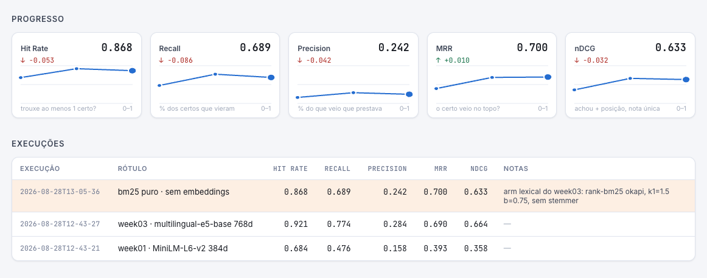

# week03 — dois braços, um gabarito

**Antes:** um RAG com MiniLM (inglês). **Agora:** duas alternativas medidas lado a lado.

| | [`new-model/`](new-model) | [`bm25/`](bm25) |
|---|---|---|
| como busca | vetor, significado | palavra exata |
| modelo | `multilingual-e5-base` (fala português) | nenhum |
| acha bem | "animal sem tutor" ≈ "animal comunitário" | `FNARC`, `1502/2026` |

## Resultado (38 perguntas, k=5)



| | MiniLM (week01) | e5-base | BM25 |
|---|---|---|---|
| hit rate | 0.684 | **0.921** | 0.868 |
| recall | 0.476 | **0.774** | 0.689 |
| MRR | 0.393 | 0.690 | **0.700** |
| nDCG | 0.358 | **0.664** | 0.633 |

- Trocar só o modelo quase dobrou o MRR.
- BM25, sem modelo nenhum, fica perto do e5.
- **Erram em perguntas diferentes**: só 1 das 38 falha nos dois. Isso pede juntar os dois (week06).

## Rodando

Portas deslocadas pra subir os dois juntos:

```bash
cd new-model && docker compose up --build   # chat :3011 · api :8001
cd bm25      && docker compose up --build   # chat :3021 · api :8002
```

**Próximo:** cada comparação exige um stack novo. → [week04](../week04)
