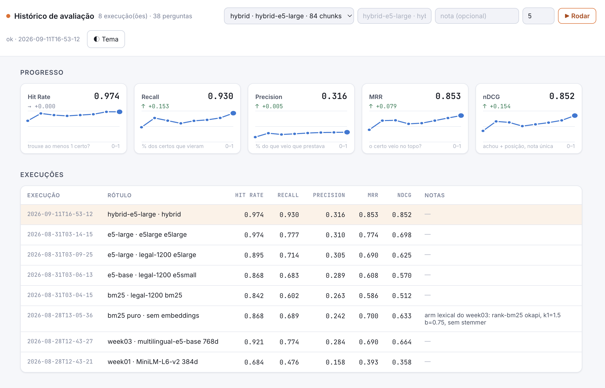

# week06 — híbrido (BM25 + vetor)

**Antes:** escolhe um: BM25 **ou** vetor. **Agora:** `hybrid-<modelo>` roda os dois e junta.

## Juntar por posição, não por nota

BM25 dá notas sem teto (3.2, 41.0); cosseno dá 0–1. Não dá pra somar.
RRF usa só a **posição**: `score = Σ 1/(60 + posição)`.

| chunk | BM25 | vetor | RRF |
|---|---|---|---|
| A | 1º | 3º | 1/61 + 1/63 = **0.0323** |
| D | 7º | 9º | 1/67 + 1/69 = 0.0294 |
| C | — | 1º | 1/61 = 0.0164 |
| B | 2º | — | 1/62 = 0.0161 |

Quem aparece nos dois ganha de quem só um viu.

## BM25 em português

| antes | agora |
|---|---|
| `decisão` ≠ `decisões` ≠ `decisao` | stemmer + tira acento → `decis` |
| `Lei 8.666/93` → `8`, `666`, `93` | `lei`, `8666/93` |
| `FNARC` ≠ "Fundo Nacional de ... (FNARC)" | siglas aprendidas do corpus, expande nos dois sentidos |

## Rodando

```bash
docker compose up --build        # ui :3000 · api :8000/docs
```

Mesmo corpus em três buckets (`bm25`, `e5-large`, `hybrid-e5-large`) mostra o
que a fusão ganha. Ajustes no compose: `BM25_K1`, `BM25_B`, `RRF_K`, `RRF_DEPTH`.



**Próximo:** achar é uma coisa; pôr o melhor em 1º é outra. → [week07](../week07)
